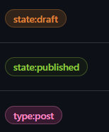

## Guide to publish a Blog

Before publishing the first blog create new labels in your issue named `type:post`, `state:published`, and `state:draft`.

You should have the following labels before publishing the blog.

You can then create a gitHub issue for your Blog Post.
Set the title of the issue as the Title of the Blog
Add a front matter in the issue to create a slug for your post URL like this:
##
        ---
        slug: your-slug-title
        date: <date-of-publication> # (DD-Mon-YYYY) Format
        summary: <one-line-summary>
        readingTime: <time-to-read>
        image: <image-url>
        ---

After the frontmatter you can add any content in markdown in the issue body. Just make sure to add atleast one heading using ##.
Refer to the blog template to understand better.

